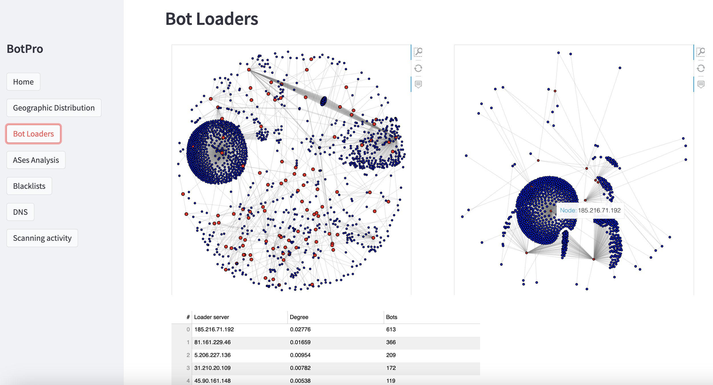
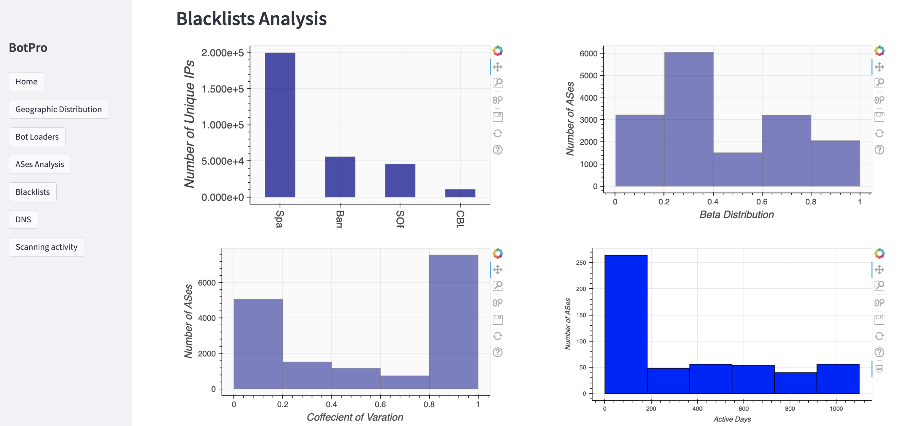

# Profiling IoT botnet activty (BotPro)
### Project information:

The highly heterogeneous nature of IoT devices and their broad deployments has resulted in numerous security issues and measurement-based difficulties, strongly impeding the collection, analysis, and correlation of IoT-centric data. Therefore, it is essential to build ground truth data and perform macroscopic measurement analysis in order to adequately profile and track the activity of IoT botnets in the wild.

**Author:** [Hatem Almazarqi](mailto:h.almazarqi.1@research.gla.ac.uk)

**Supervisor** [Dr. Angelos Marnerides](mailto:marnerides.angelos@ucy.ac.cy)

-----------------

# BotPro analysis dashboard

BotPro is an open-source cybersecurity dashboard for profiling IoT botnet activity. This tool offers a range of features and visualisations to help analyse and understand the behaviour of IoT botnets.

# BotPro installation guide

Follow these steps to set up BotPro on your local machine:

## Prerequisites
- **Docker**: Ensure Docker is installed and running. [Install Docker](https://www.docker.com/)
- **MongoDB**: Used for storing and managing data. [MongoDB Installation Guide](https://docs.mongodb.com/manual/installation/)
- **Python 3.7** or higher. [Download Python 3.7](https://www.python.org/downloads/release/python-370/)
- **pip**: Python package manager
- **RabbitMQ**: For message queuing and communication between components. [Download RabbitMQ](https://www.rabbitmq.com/download.html)

## Installation steps

### 1. Clone the repository
```bash
git clone https://github.com/almazarqi/BotPro.git
cd BotPro

# Create a virtual environment
python -m venv venv
```


### 2.  Create and activate a virtual environmen

Create:
```bash
python -m venv venv
```


Activate (Windows):
```bash
venv\Scripts\activate
```


Activate (macOS and Linux):
```bash
source venv/bin/activate
```

### 3. Run RabbitMQ container
```bash
docker run -d --name rabbitmq -p 5672:5672 -p 15672:15672 rabbitmq:3-management
```

### 4.Install dependencies
```bash
pip install -r requirements.txt
```

## Using RabbitMQ with BotPro
### Publishers and Consumers for Data Processing

BotPro utilizes RabbitMQ for message queuing, which involves publishers and consumers to build and manage the dataset. 
#### IP Blacklists:
- **Publisher** (`Blacklists_publisher.py`): publishes IP addresses to be checked against various blacklists. It sends messages containing IP addresses to a RabbitMQ queue
- **Consumer** (`Blacklists_consumer.py`): receives the IP addresses from the queue and checks them against the blacklists and store the result.
#### ASes
- **Publisher**  (`ASes_publisher.py`): script is responsible to publish a set of source IP addresses to a RabbitMQ queue. 
- **Consumer** (`ASes_consumer.py`): receives the IP addresses from the RabbitMQ queue and uses the ipwhois library to retrieve corresponding ASN information. 


#### MaxMind:
- **Publisher** (`MaxMind_publisher.py`): responsible for sending IP addresses to a RabbitMQ queue to determine the geographic location.
- **Consumer** (`MaxMind_consumer.py`): receives the IP addresses from the RabbitMQ queue and queries the MaxMind database to find their geographic locations. The results, including information like country, latitude, longitude are stroed.


#### CAIDA:
- **Publisher**  (`CAIDA_publisher.py`):  publishes requests to the RabbitMQ queue, looking for specfic AS details from the CAIDA ASRank API.
- **Consumer** (`CAIDA_consumer.py`): retrieves the requests from the RabbitMQ queue and interacts with the CAIDA ASRank API to acquire the AS information.

#### DNS:
- **Publisher** (`DNS_publisher.py`): publishes IP addresses to a RabbitMQ queue for DNS lookups. The script sends requests to resolve IP addresses to their respective DNS.

- **Consumer** (`DNS_consumer.py`): retrieves IP address lookup requests from the RabbitMQ queue and performs DNS queries. It processes the responses, extracting PTR records and TTL values.

#### Shadowserver: 

- **Publisher** (`Shadowserver_publisher.py`): sends ASN data to a RabbitMQ queue, setting up API requests for the Shadowserver API to get information about the advertised IP prefixes for each ASN.
- **Consumer** (`Shadowserver_consumer.py`): retrieves ASN lookup requests from the RabbitMQ queue and interacts with the Shadowserver API. It processes the responses to extract information, including prefix count and associated prefixes for each ASN.

## Features & benefits
 **A. Scanning analysis:** shows the scanning behavior of IoT botnets by analyzing real-world data collected through BotPro.

 **B. Bot loaders:**  processes the payload structures to profile IoT botnet loaders that were used in the initial stages of an infection. It resposible to detect the bot loaders and related to malware varaients.

 **C. AS level:** conduct a comprehensive AS-level analysis of IoT botnet propagation using the measurement infrastructure and shows the influence of AS structural properties on the spread and tolerance of IoT botnet activities.  It operates at the AS- level, and provides a macroscopic view of IoT botnet activities and their origine.
 
 **D. Blacklists:** leverages  widely-used IP blacklists and  evaluate their effeciency in capturing IoT botnet activity.
 
 **E. Infections:** analyse the nature and types of malware deployed in botnet activities, and provides insights into how infections spread and their impact.


## Dataset and external services:

### Dataset:
BotPro builds real ground truth data from Open-source intelligence (OSINT) feeds, featuring real IoT-based botnets traffic. This includes monitoring globally distributed honeypots for real malicious events.


### External services
#### - Attack honeypots:
collect cyber threat intelligence (CTI) data generated by attack honeypots. The honeypots detect active botnets by emulating hundreds of vulnerable IoT devices, including IP cameras, smart home devices and consumer-grade routers frequently targeted by botnets that scan the internet and engage in malicious activity.
#### - IP address reputation:
four different IP global IP blacklist databases used including: (i) Spamhaus, (ii) Barracuda, (iii) Spam Open Relay Blocking System (SORBS) and (iv) Composite Blocking List (CBL).
#### - BGP routing:
Provide information about the AS-level connectivity of the Internet. It assess the impact of botnets on the overall Internet infrastructure.
#### - DNS: 
leverages DNS data to resolve domain names associated with suspicious IP addresses, and shows the bhaviour of botnet in locating the C&C servers.
#### - Geographic distribution: 
integrates geographic data such as MaxMind to visualise and trace the geographic origins of IoT botnet activities. It aids in identifying the source regions of attacks.


## Insights using BotPro:


<figure>
  
  <figcaption> Network topologies for ASes generated by BotPro, suggesting that nodes identified by centrality metrics are more effective at spreading malicious content throughout the Internet.</figcaption>
</figure>
<br><br>


<figure>
  
  <figcaption> Snapshot of the BotPro dashboard for tracking bot loaders and detecting super nodes</figcaption>
</figure>

<br><br>

<figure>
  
  <figcaption> Map illustrates the global spread and density of IoT botnet activities. It highlights regions with the highest concentration of botnet activities.</figcaption>
</figure>


<br><br>

<figure>
  
  <figcaption> Common scanning patterns generated by IoT botnets and observed by BotPro.
</figcaption>
</figure>

<br><br>

<figure>
  
  <figcaption> Snapshot showing the capabilities of BotPro in assessing the effectiveness of widely used IP blacklists in capturing IoT botnet activity using different matrices.
</figcaption>
</figure>
